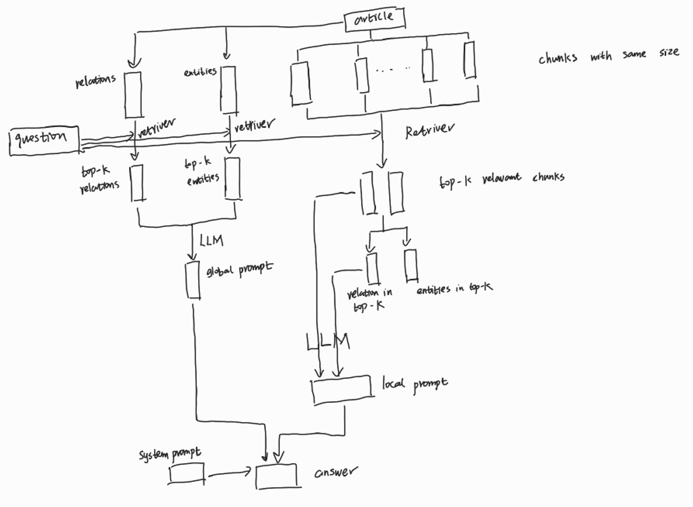

# <A Document-Focused Question-Answering System for Extracting Precise Information from Uploaded Files Using Advanced Language Models>  

## Author
Yichen REN (zaoduyuan@gmail.com)

## Overview

This is the code that implements a Document-Focused Question-Answering System with multiple improvements on functionality.  

## Setup

List the steps needed to install your module's dependencies: 

1. python 3.12.4,    pip 24.1.2  

2. requirements.txt are as listed   
```
pip install -r requirements.txt 
```

3. Need to deploy Llama (OLlama locally)

4. Run src/minor_tests/test_local_llama.py, if executable, then Llama has been successfully installed using OLlama  

## Codebase Structure

It is very important to also include an overall breakdown of your repo's file structure. Let people know what is in each directory and where to look if they need something specific. This will also let users know how your repo needs to structured so that your module can work properly

```
Yichen-REN-repo-name/
    - requirements.txt
    - aborted/
    - answer/
        -- selfmade_answer/                                   
        -- selfmade_answer_Llama3_2000_pairwise_distance/  
        -- squad_answer_Llama3/
        -- selfmade_answer_Llama3_1000_dense_path_retrieval/  
        -- squad_answer_GPT3.5-Turbo/
        -- selfmade_answer_Llama3_2000_dense_path_retrieval/  
        -- squad_answer_GPT3.5-Turbo_with_context/
    - data/ 
        -- pubmedqa_answer/
        -- pubmedqa_context/
        -- pubmedqa_question/
        -- example_index/
        -- squad_question/
        -- intelligent_scissor_index/
        -- paperqa_test/
        -- selfmade_context/
        -- selfmade_question/
        -- squad_context/
        -- example.pdf
        -- intelligent_scissors.pdf
        -- lightrag.pdf
        -- squad_dataset.json
        -- PubMedQA_dataset.json
        -- output.txt
        -- answer.txt
        -- example_paper.txt
        -- result.jsonl

    - src/
        -- workflow/  
            --- workflow_demo.py    
            --- workflow_large_scale_abstract.py    
            --- workflow_large_scale_ollama.py    
            --- workflow_large_scale_openai.py  
        -- minor_tests/
            --- RAG_test.ipynb  
            --- find_matching_word.py    
            --- read_out.py             
            --- test_attention_map.py
            --- RAG_test.py     
            --- langchain_QA.py          
            --- read_paper_into_txt.py  
            --- test_local_llama.py
            --- ROUGE_score.py  
            --- levenshtein_distance.py  
            --- reformat_json.py
    - report/
    - results/
        -- pubmedqa_answer_Llama3_10000/                                
        -- pubmedqa_answer_Llama3_4000_pairwise_distance/
        -- pubmedqa_answer_Llama3_10000_pairwise_distance/              
        -- pubmedqa_answer_Llama3_6000/
        -- pubmedqa_answer_Llama3_1000_dense_path_retrieval/          
        -- pubmedqa_answer_Llama3_6000_pairwise_distance/
        -- pubmedqa_answer_Llama3_1000_dense_path_retrieval_highlight/  
        -- pubmedqa_answer_Llama3_8000/
        -- pubmedqa_answer_Llama3_2000/                                 
        -- pubmedqa_answer_Llama3_8000_pairwise_distance/
        -- pubmedqa_answer_Llama3_2000_dense_path_retrieval/            
        -- pubmedqa_answer_Llama3_abstract/
        -- pubmedqa_answer_Llama3_2000_pairwise_distance/               
        -- result_statistics/
        -- pubmedqa_answer_Llama3_4000/
```

Include text description of all the important files / componenets in your repo. 
* `src/workflow/`: main body of workflow, where four different code are presented, from the lighweighted demo version to the        full-length workflow built to use either GPT or Llama 
* `src/minor_tests/`: various test modules written to test different functions when i develop the code on the go
* `data/`: all the datasets, either from online or self-made are all stored here
* `results/`: the results generated by those code in src/ and those data in data/. The classification can be easily seen from their names

## Functional Design (Usage)
This code is mainly for self-paced learning and improvement. All the code can be executed on one shot in one program. No releases are currently possible.

## Demo Video

Include a link to your demo video, which you upload to our shared Google Drive folder (see the instructions for code submission).

## Algorithmic Design

The algorithm design for the RAG (Retrieval-Augmented Generation) workflow involves several components and models to achieve the task of extracting information from a PDF, indexing the content, retrieving relevant chunks based on a query, and generating a response considering entities and relations. Below is a detailed description of each component and model used in the workflow:

1. Text Extraction
Component: extract_text_from_pdf
Model/Library: fitz (PyMuPDF)
Description: This function extracts text from a PDF file by iterating through each page and extracting the text content.
2. Text Splitting
Component: split_into_chunks, split_into_paragraphs, split_into_sentences, split_into_word_clusters, split_document
Model/Library: nltk (Natural Language Toolkit)
Description: These functions split the extracted text into manageable chunks, paragraphs, sentences, and word clusters. This hierarchical splitting helps in better indexing and retrieval. 
3. Named Entity Recognition (NER)
Component: extract_entities
Model/Library: spacy (spaCy's pre-trained model en_core_web_sm)
Description: This function extracts named entities from the text using spaCy's NER capabilities.
4. Relation Extraction
Component: extract_relations
Model/Library: spacy (spaCy's dependency parsing)
Description: This function extracts relations between entities using spaCy's dependency parsing to identify subject-relation-object triples.
5. Duplicate Removal
Component: remove_duplicates
Description: This function removes duplicate entities and relations from the lists to ensure unique entries.
6. Embedding Generation
Component: generate_embedding
Model/Library: SentenceTransformer (pre-trained model all-MiniLM-L6-v2)
Description: This function generates embeddings for text chunks, entities, and relations using Sentence Transformers.
7. Vector Database Initialization and Storage
Component: faiss_index, store_in_vector_db
Model/Library: faiss (Facebook AI Similarity Search)
Description: FAISS is used to create an index for fast similarity search. The embeddings of text chunks, entities, and relations are stored in this index for efficient retrieval.
8. Retrieval of Relevant Chunks
Component: retrieve_text_chunks
Model/Library: faiss
Description: This function retrieves the top-k most relevant text chunks based on the query embedding using FAISS.
9. Retrieval of Entities and Relations
Component: retrieve_entities_and_relations
Description: This function retrieves entities and relations related to the relevant text chunks.
10. Response Generation
Component: generate_response, generate_response_with_entities_and_relations
Model/Library: transformers (GPT-2 model and tokenizer)
Description: These functions generate a response using GPT-2 based on the provided prompt, which includes the query, relevant text chunks, entities, and relations.
11. OpenAI API Integration
Component: ask_openai
Model/Library: requests
Description: This function integrates with the OpenAI API to generate responses using GPT-3.5 or other specified models.
12. Auto Merging of Chunks
Component: auto_merge_chunks
Description: This function automatically merges chunks based on their relevance to the query and ensures the combined length is within the maximum token length for the language model.
Workflow Steps
Text Extraction: Extract text from the PDF using extract_text_from_pdf.
Text Splitting: Split the extracted text into chunks using split_into_chunks or hierarchical chunks using split_document.
Entity and Relation Extraction: Extract entities and relations from each chunk using extract_entities and extract_relations.
Duplicate Removal: Remove duplicate entities and relations using remove_duplicates.
Embedding Generation: Generate embeddings for text chunks, entities, and relations using generate_embedding.
Vector Database Storage: Store the embeddings in the FAISS index using store_in_vector_db.
Retrieval: Retrieve relevant text chunks based on the query using retrieve_text_chunks
Entity and Relation Retrieval: Retrieve entities and relations related to the relevant text chunks using retrieve_entities_and_relations.
Response Generation: Generate a response using GPT-2 or OpenAI API based on the query, relevant chunks, entities, and relations using generate_response_with_entities_and_relations and ask_openai.

below is one attached draft about the overall workflow


## Issues and Future Work

In this section, please list all know issues, limitations, and possible areas for future improvement. For example:

* Though functional, some parts of code are still not being convincingly proved. In other words, I use them, find out they works well in my code, yet I do not know why they work well. Those parts of code include auto-merging, relation&entity extraction.
* The accuracy rate still goes under those commercially available tools.
* Could be modified to use local Llama model, thus reducing the overall cost and remove the speed limit


## Change Log

Use this section to list the _major_ changes made to the module if this is not the first iteration of the module. Include an entry for each semester and name of person working on the module. For example 

Fall 2024 (Yichen REN)
* Dec 18, 2024: Finalized by Yichen REN, good luck for my successors!

## References 

Include links related to datasets and papers describing any of the methodologies models you used. E.g. 

* LightRAG: https://github.com/HKUDS/LightRAG 
* HayStack: https://haystack.deepset.ai/
* Dense Path Retrieval (DPR): https://github.com/facebookresearch/DPR
* FAISS: https://github.com/facebookresearch/faiss
* RAG: https://arxiv.org/abs/2005.11401
* PubMedQA: https://pubmedqa.github.io/
* SQUAD: https://rajpurkar.github.io/SQuAD-explorer/
* Other references: Vector Databases, Indexing, Graph

## Link to online google doc
https://drive.google.com/drive/folders/1iVIaQvY5UdtR7i7jWKAEAgaaUxaP4asz?usp=drive_link 
